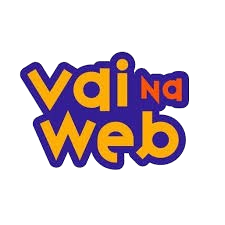

<p align="center">
  
</p>
<h1 align="center">Desafio 2 da Formação Full Stack </h1>


## 🔥 Introdução
Site desenvolvido para aplicar as boas práticas de codificação e estruturação do projeto utilizando HTML e SASS, e divulgar o Outubro Rosa.  


## 🔨 Guia de instalação
1. Clone o repositório usando o `Git`
```bash
  git clone https://github.com/tatyanepgoncalves/desafio-2.git
```
2. Abra o arquivo
```bash 
  cd desafio-2
  code .
```

3. Inicie o servidor de desenvolvimento
No arquivo `index.html` procure `live server` na barra inferior da IDE ou clique do botão direto do mouse e clique em `Open with Live Server`

> A extensão Live Server deve ser baixada para que consiga inicializar o servidor de desenvolvimento.

## 📦 Tecnologias usadas:
- HTML5
- SASS

## 👷 Autores
- **Tatyane Gonçalves** - *Desenvolvedora* - [@tatyanepgoncalves](https://github.com/tatyanepgoncalves)
- **Equipe Vai na Web** - *Criadora e educador técnico* - [@vainaweb](https://www.instagram.com/vainaweb/)